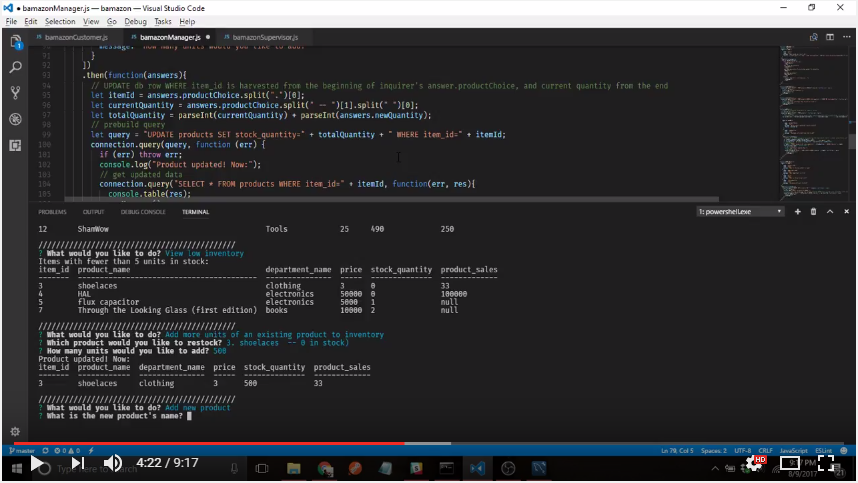

# bamazon
## store inventory management via MySQL and Node.js

This is a project I made to practice working with multiple MySQL tables in Node.

---
Video demo:

---
Built by Andy Bonner, 8/9/2017, for [the UNC coding bootcamp](https://codingbootcamp.unc.edu/) .